# Awesome Document Understanding 

A curated list of resources for Document Understanding (DU) topic related to Intelligent Document Processing (IDP), which is relative to Robotic Process Automation (RPA) from unstructured data, especially form Visually Rich Documents (VRDs). 

**Note 1: bolded positions are more important then others.**

**Note 2: due to the novelty of the field, this list is under construction - contributions are welcome (thank you in advance!).** Please remember to use following convention: 
* [Title of a publication / dataset / resource title](https://arxiv.org), \[[code/data/Website](https://github.com/example/test) \] 
  

  
 List of authors <em>Conference/Journal name</em> Year 

    Dataset size: Train(no of examples), Dev(no of examples), Test(no of examples) [Optional for dataset papers/resources]; Abstract/short description ...
  

   

# Table of contents

1. [Introduction](#introduction) 
1. [Research topics](#research-topics)
    1. [Key Information Extraction (KIE)](topics/kie/README.md)
    1. [Document Layout Analysis (DLA)](topics/dla/README.md)
    1. [Document Question Answering (DQA)](topics/dqa/README.md)  
    1. [Scientific Document Understanding (SDU)](topics/sdu/README.md)
    1. [Optical Character Recognition (OCR)](topics/ocr/README.md)       
    1. [Related](topics/related/README.md)  
        1. [General](topics/related/README.md#general) 
        1. [Tabular Data Comprehension (TDC)](topics/related/README.md#tabular-data-comprehension)
        1. [Robotic Process Automation (RPA)](topics/related/README.md#robotic-process-automation) 
1. [Others](#others)
    1. [Resources](#resources)
        1. [Datasets for Pre-training Language Models](#datasets-for-pre-training-language-models)
        1. [PDF processing tools](#pdf-processing-tools)
    1. [Conferences / workshops](#conferences-workshops) 
    1. [Blogs](#blogs)
    1. [Solutions](#solutions)
1. [Examples](#examples)
    1. [Visually Rich Documents (VRDs)](#visually-rich-documents) 
    1. [Key Information Extraction (KIE)](#key-information-extraction)
    1. [Document Layout Analysis (DLA)](#document-layout-analysis) 
    1. [Document Question Answering (DQA)](#document-question-answering)
1. [Inspirations](#inspirations)

# Introduction 

Documents are a core part of many businesses in many fields such as law, finance, and technology among others. Automatic understanding of documents such as invoices, contracts, and resumes is lucrative, opening up many new avenues of business. The fields of natural language processing and computer vision have seen tremendous progress through the development of deep learning such that these methods have started to become infused in contemporary document understanding systems. [source](https://arxiv.org/abs/2011.13534)

### Papers

#### 2021 

* [Automating Paperwork](https://edwardbenson.com/automating-paperwork) 
  

  
 Ted Benson <em>-</em> 2021 

    Automating Paperwork is a practical, no-hype technical guide for business leaders, product managers, and operations teams who are pursuing a document automation initiative at their company. Its goal is to provide an end-to-end tour of the technical decisions and tradeoffs involved so that you can prepare for success, know what to expect, and ask the right questions of engineers and vendors along the way.
  

#### 2020 

* **[A Survey of Deep Learning Approaches for OCR and Document Understanding](https://arxiv.org/abs/2011.13534)**
  

  
 Nishant Subramani, Alexandre Matton, Malcolm Greaves, Adrian Lam <em>ML-RSA Workshop at NeurIPS</em> 2020 

    Documents are a core part of many businesses in many fields such as law, finance, and technology among others. Automatic understanding of documents such as invoices, contracts, and resumes is lucrative, opening up many new avenues of business. The fields of natural language processing and computer vision have seen tremendous progress through the development of deep learning such that these methods have started to become infused in contemporary document understanding systems. In this survey paper, we review different techniques for document understanding for documents written in English and consolidate methodologies present in literature to act as a jumping-off point for researchers exploring this area. 
  

* **[Conversations with Documents. An Exploration of Document-Centered Assistance](https://arxiv.org/pdf/2002.00747.pdf)**
  

  
 Maartje ter Hoeve, Robert Sim, Elnaz Nouri, Adam Fourney, Maarten de Rijke, Ryen W. White <em>CHIIR</em> 2020 

    The role of conversational assistants has become more prevalent in helping people increase their productivity. Document-centered assistance, for example to help an individual quickly review a document, has seen less significant progress, even though it has the potential to tremendously increase a user's productivity. This type of document-centered assistance is the focus of this paper. Our contributions are three-fold: (1) We first present a survey to understand the space of document-centered assistance and the capabilities people expect in this scenario. (2) We investigate the types of queries that users will pose while seeking assistance with documents, and show that document-centered questions form the majority of these queries. (3) We present a set of initial machine learned models that show that (a) we can accurately detect document-centered questions, and (b) we can build reasonably accurate models for answering such questions. These positive results are encouraging, and suggest that even greater results may be attained with continued study of this interesting and novel problem space. Our findings have implications for the design of intelligent systems to support task completion via natural interactions with documents. 
  

#### 2019

* [Machine learning in UK financial services](https://www.bankofengland.co.uk/-/media/boe/files/report/2019/machine-learning-in-uk-financial-services.pdf)
  

  
 Carsten Jung, Henrike Muelle, Simone Pedemonte, Simone Plances, Oliver Thew <em>-</em> 2019 

    Machine learning (ML) is the development of models for prediction and pattern recognition from data, with limited human intervention. In the financial services industry, the application of ML methods has the potential to improve outcomes for both businesses and consumers.(1) In recent years, improved software and hardware as well as increasing volumes of data have accelerated the pace of ML development. The UK financial sector is beginning to take advantage of this. The promise of ML is to make financial services and markets more efficient, accessible and tailored to consumer needs.(2) At the same time, existing risks may be amplified if governance and controls do not keep pace with technological developments. But the risks presented by ML may be different in each of the contexts it is deployed in.(3) More broadly, ML also raises profound questions around the use of data, complexity of techniques and the automation of processes, systems and decision-making.
  

#### 2018

* [Future paradigms of automated processing of business documents](https://www.sciencedirect.com/science/article/pii/S0268401217309994)
  

  
 Matteo Cristania, Andrea Bertolasob, Simone Scannapiecoc, Claudio Tomazzolia <em>International Journal of Information Management</em> 2018 

    In this paper we summarize the results obtained so far in the communities interested in the development of automated processing techniques as applied to business documents, and devise a few evolutions that are demanded by the current stage of either those techniques by themselves or by collateral sector advancements. It emerges a clear picture of a field that has put an enormous effort in solving problems that changed a lot during the last 30 years, and is now rapidly evolving to incorporate document processing into workflow management systems on one side and to include features derived by the introduction of cloud computing technologies on the other side. We propose an architectural schema for business document processing that comes from the two above evolution lines.
  

#### Older 

* [Machine Learning for Intelligent Processing of Printed Documents](https://www.semanticscholar.org/paper/Machine-Learning-for-Intelligent-Processing-of-Esposito-Malerba/1f23b61f04d450ffc49ec6371bb5b30d198cdc5b)
  

  
 F. Esposito, D. Malerba, F. Lisi <em>-</em> 2004 

    A paper document processing system is an information system component which transforms information on printed or handwritten documents into a computer-revisable form. In intelligent systems for paper document processing this information capture process is based on knowledge of the specific layout and logical structures of the documents. This article proposes the application of machine learning techniques to acquire the specific knowledge required by an intelligent document processing system, named WISDOM++, that manages printed documents, such as letters and journals. Knowledge is represented by means of decision trees and first-order rules automatically generated from a set of training documents. In particular, an incremental decision tree learning system is applied for the acquisition of decision trees used for the classification of segmented blocks, while a first-order learning system is applied for the induction of rules used for the layout-based classification and understanding of documents. Issues concerning the incremental induction of decision trees and the handling of both numeric and symbolic data in first-order rule learning are discussed, and the validity of the proposed solutions is empirically evaluated by processing a set of real printed documents.
  

* [Document Understanding: Research Directions](https://citeseerx.ist.psu.edu/viewdoc/download?doi=10.1.1.40.9880&rep=rep1&type=pdf)
  

  
 S. Srihari, S. Lam, V. Govindaraju, R. Srihari, J. Hull <em>-</em> 1994 

    A document image is a visual representation of a printed page such as a journal article page, a facsimile cover page, a technical document, an office letter, etc. Document understanding as a research endeavor consists of studying all processes involved in taking a document through various representations: from a scanned physical document to high-level semantic descriptions of the document. Some of the types of representation that are useful are: editable descriptions, descriptions that enable exact reproductions and high-level semantic descriptions about document content. This report is a definition of five research subdomains within document understanding as pertaining to predominantly printed documents. The topics described are: modular architectures for document understanding; decomposition and structural analysis of documents; model-based OCR; table, diagram and image understanding; and performance evaluation under distortion and noise. 
  

# Research topics

* [Key Information Extraction (KIE)](topics/kie/README.md)
* [Document Layout Analysis (DLA)](topics/dla/README.md)
* [Document Question Answering (DQA)](topics/dqa/README.md)
* [Scientific Document Understanding (SDU)](topics/sdu/README.md)  
* [Optical Character Recogtion (OCR)](topics/ocr/README.md)
* [Related](topics/related/README.md)
  * [General](topics/related/README.md#general) 
  * [Tabular Data Comprehension (TDC)](topics/related/README.md#tabular-data-comprehension)
  * [Robotic Process Automation (RPA)](topics/related/README.md#robotic-process-automation) 

# Others

## Resources

[Back to top](#table-of-contents)

#### Datasets for Pre-training Language Models

1. [The RVL-CDIP Dataset](https://www.cs.cmu.edu/~aharley/rvl-cdip/) - dataset consists of 400,000 grayscale images in 16 classes, with 25,000 images per class
1. [The Industry Documents Library](https://www.industrydocuments.ucsf.edu/) - a portal to millions of documents created by industries that influence public health, hosted by the UCSF Library
1. [Color Document Dataset](www.science.uva.nl/UvA-CDD/UvA-CDD.tar.gz) - from the Intelligent Sensory Information Systems, University of Amsterdam
1. [The IIT CDIP Test Collection](https://ir.nist.gov/cdip/README.txt) - broken, see [github discussion](https://github.com/cneud/ocr-gt/issues/12)

#### PDF processing tools

1. [pawls](https://github.com/allenai/pawls)  - PDF Annotations with Labels and Structure is software that makes it easy to collect a series of annotations associated with a PDF document
1. [pdfplumber](https://github.com/jsvine/pdfplumber)  - Plumb a PDF for detailed information about each text character, rectangle, and line. Plus: Table extraction and visual debugging
1. [Pdfminer.six](https://github.com/pdfminer/pdfminer.six)  - Pdfminer.six is a community maintained fork of the original PDFMiner. It is a tool for extracting information from PDF documents. It focuses on getting and analyzing text data 
1. [Layout Parser](https://github.com/Layout-Parser/layout-parser)  - Layout Parser is a deep learning based tool for document image layout analysis tasks
1. [Tabulo](https://github.com/interviewBubble/Tabulo)  - Table extraction from images
1. [OCRmyPDF](https://github.com/jbarlow83/OCRmyPDF)  - OCRmyPDF adds an OCR text layer to scanned PDF files, allowing them to be searched or copy-pasted
1. [PDFBox](https://github.com/apache/pdfbox)  - The Apache PDFBox library is an open source Java tool for working with PDF documents. This project allows creation of new PDF documents, manipulation of existing documents and the ability to extract content from documents
1. [PdfPig](https://github.com/UglyToad/PdfPig)  - This project allows users to read and extract text and other content from PDF files. In addition the library can be used to create simple PDF documents containing text and geometrical shapes. This project aims to port PDFBox to C#
1. [parsing-prickly-pdfs](https://porter.io/github.com/jsfenfen/parsing-prickly-pdfs)  - Resources and worksheet for the NICAR 2016 workshop of the same name
1. [pdf-text-extraction-benchmark](https://github.com/ckorzen/pdf-text-extraction-benchmark)  - PDF tools benchmark
1. [Born digital pdf scanner](https://github.com/applicaai/digital-born-pdf-scanner)  - checking if pdf is born-digital   

## Conferences, workshops

[Back to top](#table-of-contents)

#### General/ Business / Finance

1. **International Conference on Document Analysis and Recognition (ICDAR)** [[2021](https://icdar2021.org/), [2019](http://icdar2019.org/), [2017](http://u-pat.org/ICDAR2017/index.php)]
1. Workshop on Document Intelligence (DI) [[2021](https://document-intelligence.github.io/DI-2021/), [2019](https://sites.google.com/view/di2019)]
1. Financial Narrative Processing Workshop (FNP) [[2021](http://wp.lancs.ac.uk/cfie/fnp2021/), [2020](http://wp.lancs.ac.uk/cfie/fincausal2020/), [2019](https://www.aclweb.org/anthology/volumes/W19-64/) ]   
1. Workshop on Economics and Natural Language Processing (ECONLP) [[2021](https://julielab.de/econlp/2021/), [2019](https://sites.google.com/view/econlp-2019), [2018](https://www.aclweb.org/anthology/W18-31.pdf) ]   
1. INTERNATIONAL WORKSHOP ON DOCUMENT ANALYSIS SYSTEMS (DAS) [[2020](https://www.vlrlab.net/das2020/), [2018](https://das2018.cvl.tuwien.ac.at/en/), [2016](https://www.primaresearch.org/das2016/)]
1. [ACM International Conference on AI in Finance (ICAIF)](https://ai-finance.org/)   
1. [The AAAI-21 Workshop on Knowledge Discovery from Unstructured Data in Financial Services](https://aaai-kdf.github.io/kdf2021/)
1. [CVPR 2020 Workshop on Text and Documents in the Deep Learning Era](https://cvpr2020text.wordpress.com/accepted-papers/)
1. [KDD Workshop on Machine Learning in Finance (KDD MLF 2020)](https://sites.google.com/view/kdd-mlf-2020)
1. [FinIR 2020: The First Workshop on Information Retrieval in Finance](https://finir2020.github.io/)   
1. [2nd KDD Workshop on Anomaly Detection in Finance (KDD 2019)](https://sites.google.com/view/kdd-adf-2019)
1. [Document Understanding Conference (DUC 2007)](https://duc.nist.gov/pubs.html)

#### Scientific Document Understanding

1. [The AAAI-21 Workshop on Scientific Document Understanding (SDU 2021)](https://sites.google.com/view/sdu-aaai21/home)
1. [First Workshop on Scholarly Document Processing (SDProc 2020)](https://ornlcda.github.io/SDProc/)
1. International Workshop on SCIentific DOCument Analysis (SCIDOCA) [[2020](http://research.nii.ac.jp/SCIDOCA2020/), [2018](http://www.jaist.ac.jp/event/SCIDOCA/2018/), [2017](https://aclweb.org/portal/content/second-international-workshop-scientific-document-analysis) ]

## Blogs

[Back to top](#table-of-contents)

1. [Document Form Extraction](https://www.crosstab.io/product-comparisons/document-form-extraction), 2021
1. [How to automate processes with unstructured data](https://levity.ai/blog/automate-processes-with-unstructured-data), 2021
1. [Introducing TILT – Applica’s revolutionary new language model](https://applica.ai/2021/03/12/introducing-tilt-applicas-revolutionary-new-language-model/), 2021
1. [A Comprehensive Guide to OCR with RPA and Document Understanding](https://nanonets.com/blog/ocr-with-rpa-and-document-understanding-uipath/), 2021
1. [Information Extraction from Receipts with Graph Convolutional Networks](https://nanonets.com/blog/information-extraction-graph-convolutional-networks/), 2021
1. [How to extract structured data from invoices](https://nanonets.com/blog/extract-structured-data-from-invoice/), 2021
1. [Extracting Structured Data from Templatic Documents](https://ai.googleblog.com/2020/06/extracting-structured-data-from.html), 2020
1. [To apply AI for good, think form extraction](http://jonathanstray.com/to-apply-ai-for-good-think-form-extraction), 2020
1. [UiPath Document Understanding Solution Architecture and Approach](https://medium.com/@lahirufernando90/uipath-document-understanding-solution-architecture-and-approach-934a9a26630a), 2020
1. [How Can I Automate Data Extraction from Complex Documents?](https://www.infrrd.ai/blog/how-can-i-automate-data-extraction-from-complex-documents), 2020
1. [LegalTech: Information Extraction in legal documents](https://naturaltech.medium.com/legaltech-information-extraction-in-legal-documents-e1843a60bc8d), 2020
1. [How to extract the structure of invoice data using tensorflow API faster crnn object detection](https://vigneshgig.medium.com/how-to-extract-the-structure-of-invoice-data-using-tensorflow-api-faster-crnn-object-detection-8aa15c12bb46), 2019

## Solutions

[Back to top](#table-of-contents)

Big companies: 
1. [Abby](https://www.abbyy.com/flexicapture/)
1. [Accenture](https://www.accenture.com/us-en/services/applied-intelligence/document-understanding-solutions)
1. [Amazon](https://aws.amazon.com/about-aws/whats-new/2020/11/introducing-document-understanding-solution/)
1. [Google](https://cloud.google.com/document-ai)
1. [Microsoft](https://azure.microsoft.com/en-us/services/cognitive-services/)
1. [Uipath](https://www.uipath.com/product/document-understanding)

Smaller:
1. [Applica.ai](https://applica.ai/)
1. [Docstack](https://www.docstack.com/ai-document-understanding)
1. [Element AI](https://www.elementai.com/products/document-intelligence)
1. [Indico](https://indico.io)
1. [Nanonets](https://nanonets.com)
1. [Rossum](https://rossum.ai/)
1. [Silo](https://silo.ai/how-document-understanding-improves-invoice-contract-and-resume-processing/)

# Examples

## Visually Rich Documents

[Back to top](#table-of-contents)

In VRDs the importance of the layout information is crutial to understand whole document correctly (this is the case it almost all business documents). For humans spatial information improves readability and speeds document understanding.

#### Invoice / Resume / Job Ad 

  <a href="https://arxiv.org/pdf/2005.11017.pdf">
    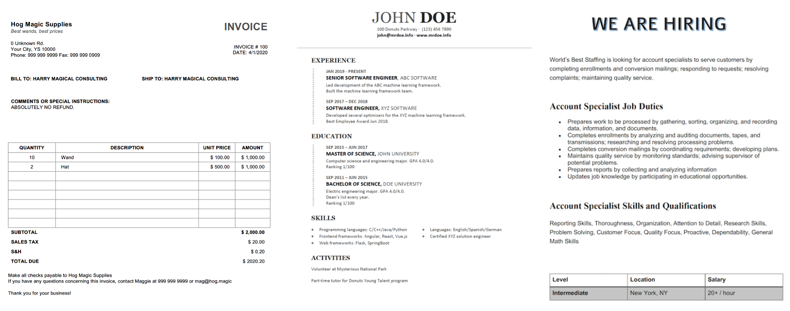
  </a>

  

#### NDA / Annual reports 

  <a href="https://arxiv.org/abs/2003.02356">
    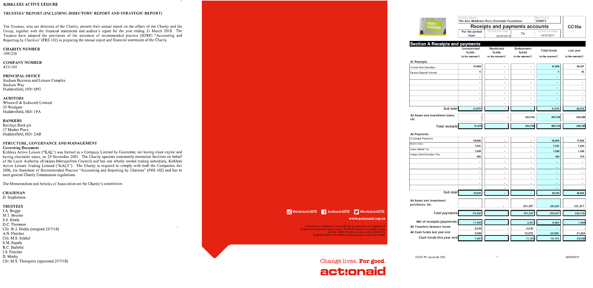
  </a>

  

## Key Information Extraction

[Back to top](#table-of-contents)

The aim of this task is to extract texts of a number of key fields from given collection of documentes containing similar key entites. 

 

#### Scanned Receipts 

  <a href="https://medium.com/analytics-vidhya/extracting-structured-data-from-invoice-96cf5e548e40">
    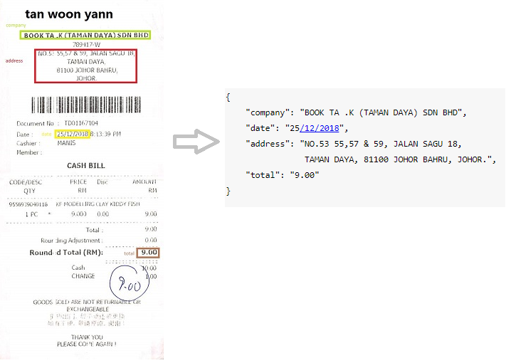
  </a>

  

#### NDA / Annual reports 

Examples of a real business applications and data for Kleister datasets (The key entities are in blue)

  <a href="https://arxiv.org/abs/2003.02356">
    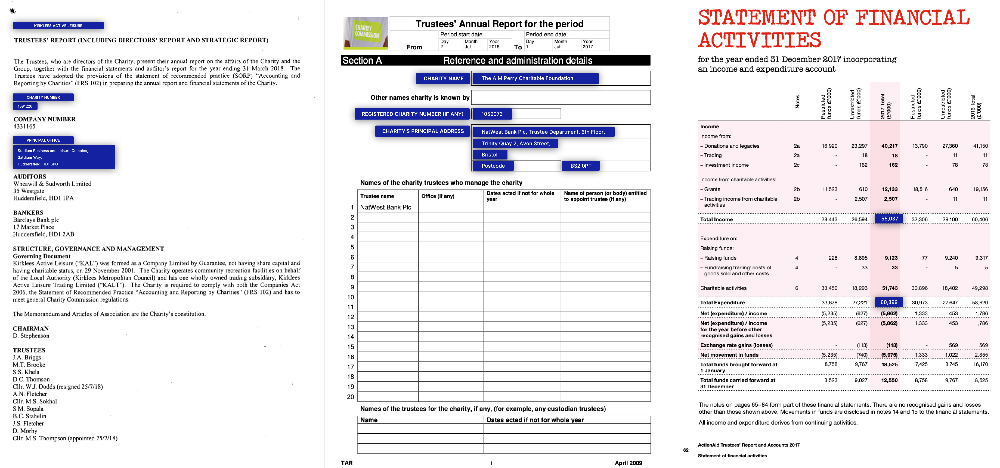
  </a>

  

#### Multimedia Online Flyers

An example of a commercial real estate flyer and  manually  entered  listing  information © ProMaker Commercial Real Estate LLC, © BrokerSavant Inc.

  <a href="https://www.aclweb.org/anthology/N15-1032.pdf">
    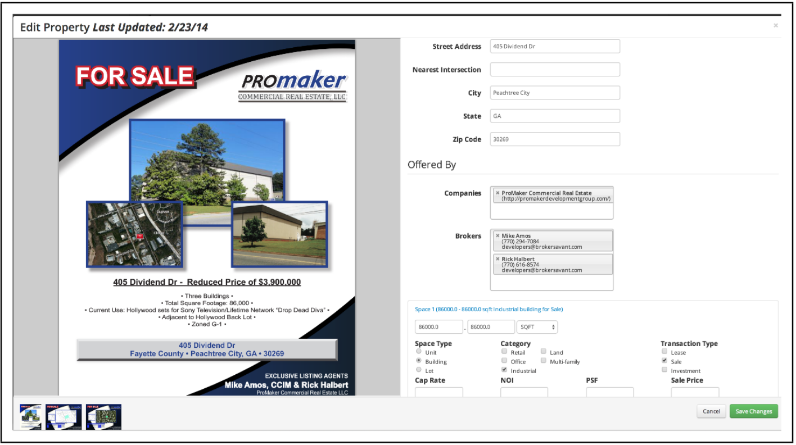
  </a>

  

#### Value-added tax invoice

  

  

#### Webpages

  <a href="https://www.microsoft.com/en-us/research/wp-content/uploads/2016/02/StructedDataExtraction_SIGIR2011.pdf">
    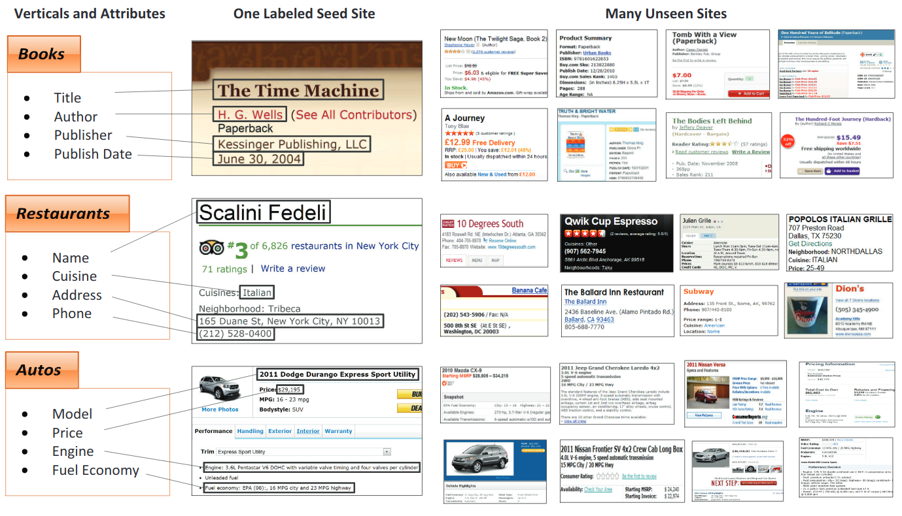
  </a>

  

## Document Layout Analysis

[Back to top](#table-of-contents)

In computer vision or natural language processing, document layout analysis is the process of identifying and categorizing the regions of interest in the scanned image of a text document. A reading system requires the segmentation of text zones from non-textual ones and the arrangement in their correct reading order. Detection and labeling of the different zones (or blocks) as text body, illustrations, math symbols, and tables embedded in a document is called geometric layout analysis. But text zones play different logical roles inside the document (titles, captions, footnotes, etc.) and this kind of semantic labeling is the scope of the logical layout analysis. (https://en.wikipedia.org/wiki/Document_layout_analysis)

#### Scientific publication 

  <a href="https://arxiv.org/pdf/1908.07836.pdf">
    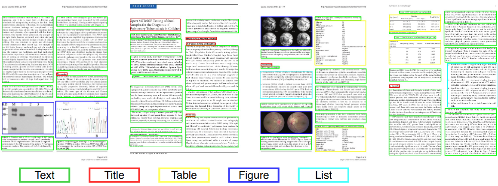
  </a>

  

  <a href="https://arxiv.org/pdf/2006.01038.pdf">
    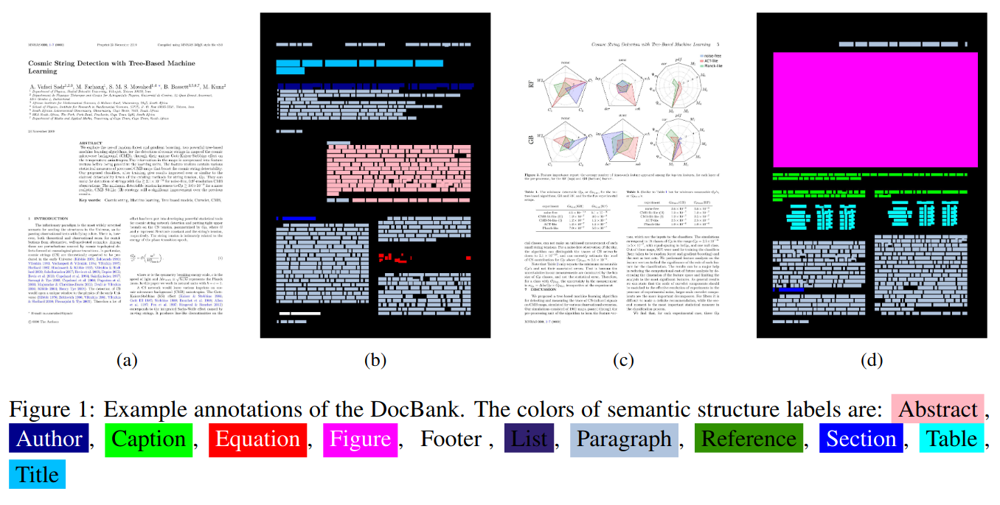
  </a>

  

#### Historical newspapers

  <a href="https://primaresearch.org/www/assets/papers/ICDAR2015_Clausner_ENPDataset.pdf">
    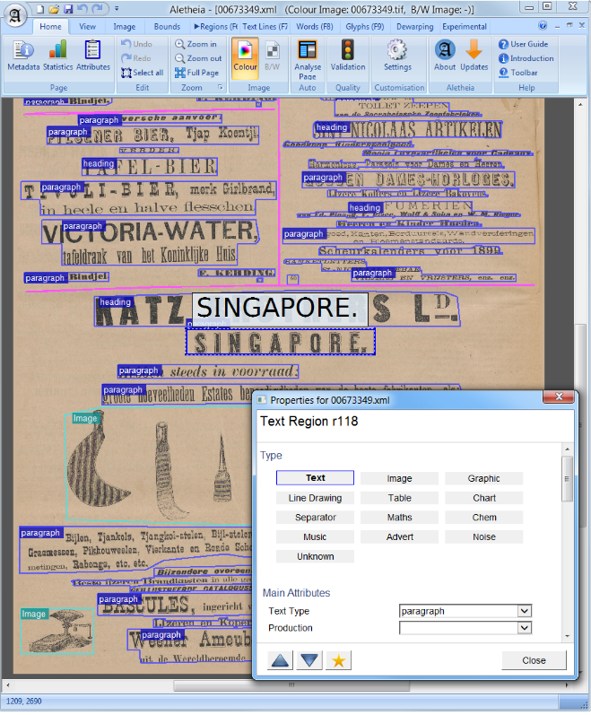
  </a>

  

#### Business documents 

Red: text block, Blue: figure.

  <a href="http://personal.psu.edu/duh188/papers/ICDAR2017_DAFANG.pdf">
    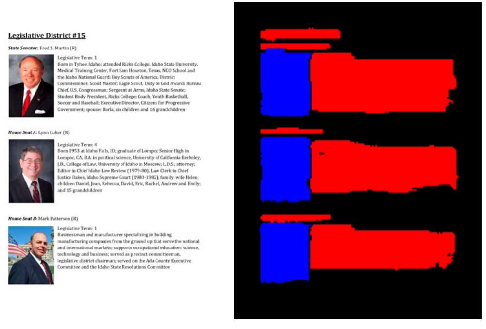
  </a>

  

## Document Question Answering 

[Back to top](#table-of-contents)  

#### DocVQA example 

  <a href="https://arxiv.org/pdf/2007.00398.pdf">
    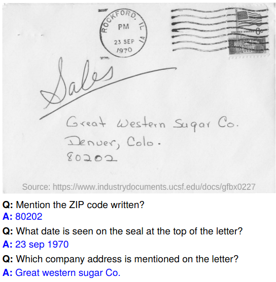
  </a>

  

#### [Tilt model](https://arxiv.org/pdf/2102.09550.pdf) demo

  <a href="https://arxiv.org/pdf/2102.09550.pdf">
    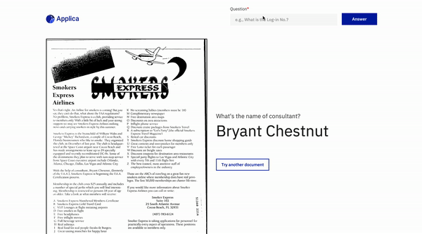
  </a>

  

# Inspirations

[Back to top](#table-of-contents)

**Domain**
1. https://github.com/zacharywhitley/awesome-ocr 
1. https://github.com/kba/awesome-ocr 
1. https://github.com/Liquid-Legal-Institute/Legal-Text-Analytics 
1. https://github.com/icoxfog417/awesome-financial-nlp 
1. https://github.com/harpribot/awesome-information-retrieval 
1. https://github.com/roomylee/awesome-relation-extraction 
1. https://github.com/caufieldjh/awesome-bioie 
1. https://github.com/BobLd/DocumentLayoutAnalysis 
1. https://github.com/bikash/DocumentUnderstanding 
1. https://github.com/HelloRusk/entity-related-papers 

**General AI/DL/ML** 
1. https://github.com/jsbroks/awesome-dataset-tools 
1. https://github.com/EthicalML/awesome-production-machine-learning 
1. https://github.com/eugeneyan/applied-ml 
1. https://github.com/awesomedata/awesome-public-datasets 
1. https://github.com/keon/awesome-nlp 
1. https://github.com/thunlp/PLMpapers 
1. https://github.com/jbhuang0604/awesome-computer-vision#awesome-lists 
1. https://github.com/papers-we-love/papers-we-love 
1. https://github.com/BAILOOL/DoYouEvenLearn 
1. https://github.com/hibayesian/awesome-automl-papers 
1. http://datasets.visionbib.com/index.html 

**More awesome**
1. https://github.com/sindresorhus/awesome 
1. https://github.com/vinta/awesome-python 